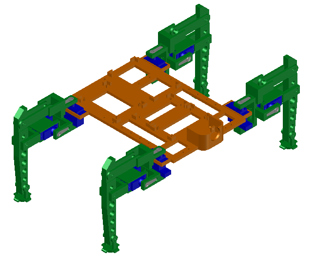

# Wi-Fi Controlled Robot With Camera

## Introduction

  The project is a spider with 4 legs controlled through Wi-Fi. It is equiped with a camera that will transmit the images it records to the app that controls it.

## Description

  The spider will use an ESP32 microcontroller for its access to Wi-Fi. The ESP32 will be connected through I2C to a Camera Module with a FIFO buffer and through serial to another microcontroller, the ESP8266. The ESP8266 will be connected through I2C to a servo motor driver and a gyroscope. The robot will be controlled through an app to which it will transmit the images the camera records. For its power source, 2 18500 Li-ion Batteries will be used. The batteries together supply 7.4V and 4800mAh. As 7.4V is to high for the Servo Driver, a Voltage Step Down Module will be used to reduce it to 5V. A switch is placed between the Batteries and the Voltage Step Down Module to turn off the robot when not in use.
  Each of its legs will have 2 Servo Motors: one at the base rotating on the Z axis, and one rotating on the X axis.
  The body and the legs of the robot are 3D printed.

## Hardware Design

### Block Diagram

### Electric Diagram

### Components

| Component | Count | Place of Aquisition | Datasheet |
|-----------|-------|---------------------|---------- |
| ESP32 Development Board | 1 | Optiums Digital | https://www.espressif.com/sites/default/files/documentation/esp32_datasheet_en.pdf |
| ESP8266 Development Board | 1 | Optimus Digital | - |
| PCA9685 Servo Driver | 1 | Optimus Digital | https://cdn-shop.adafruit.com/datasheets/PCA9685.pdf |
| SG90 Servo Motor | 8 | Optimus Digital | http://www.ee.ic.ac.uk/pcheung/teaching/DE1_EE/stores/sg90_datasheet.pdf |
| OV7670 + AL422B FIFO Camera Module | 1 | Optimus Digital | https://www.haoyuelectronics.com/Attachment/OV7670%20+%20AL422B%28FIFO%29%20Camera%20Module%28V2.0%29/OV7670%20Implementation%20Guide%20%28V1.0%29.pdf|
| Voltage Step Down Module (8A; In: 4-40V, Out: 1.25-36V) | 1 | Optimus Digital | - |
| Battery Support 2x 18500 | 1 | Optimus Digital | - |
| 18500 Li-Ion Battery 3.7V 4800mAh | 2 | - | - |
| 4.7K Resistor | 4 | - | - |
| Wires | - | Optimus Digital | - |

### 3D Model

## Software Design

## Results

## Conclusions

## Resources
