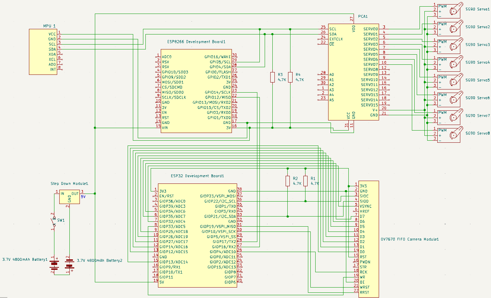

# Wi-Fi Controlled Robot With Camera

## Introduction

  The project is a spider with 4 legs controlled through Wi-Fi. It is equiped with a camera that will transmit the images it records to the app that controls it.

## Description

  The spider will use an ESP32 microcontroller for its access to Wi-Fi. The ESP32 will be connected through I2C to a Camera Module with a FIFO buffer and through serial to another microcontroller, the ESP8266. The ESP8266 will be connected through I2C to a servo motor driver and a gyroscope. The robot will be controlled through an app to which it will transmit the images the camera records. For its power source, 2 18500 Li-ion Batteries will be used. The batteries together supply 7.4V and 4800mAh. As 7.4V is to high for the Servo Driver, a Voltage Step Down Module will be used to reduce it to 5V. A switch is placed between the Batteries and the Voltage Step Down Module to turn off the robot when not in use.
  Each of its legs will have 2 Servo Motors: one at the base rotating on the Z axis, and one rotating on the X axis.
  The body and the legs of the robot are 3D printed.

## Hardware Design

### Block Diagram

### Electric Diagram

### Components

| Component | Count | Place of Aquisition | Datasheet |
|-----------|-------|---------------------|---------- |
| ESP32 Development Board | 1 | Optiums Digital | https://www.espressif.com/sites/default/files/documentation/esp32_datasheet_en.pdf |
| ESP8266 Development Board | 1 | Optimus Digital | https://www.espressif.com/sites/default/files/documentation/esp8266-technical_reference_en.pdf |
| PCA9685 Servo Driver | 1 | Optimus Digital | https://cdn-shop.adafruit.com/datasheets/PCA9685.pdf |
| SG90 Servo Motor | 8 | Optimus Digital | http://www.ee.ic.ac.uk/pcheung/teaching/DE1_EE/stores/sg90_datasheet.pdf |
| OV7670 + AL422B FIFO Camera Module | 1 | Optimus Digital | https://www.haoyuelectronics.com/Attachment/OV7670%20+%20AL422B%28FIFO%29%20Camera%20Module%28V2.0%29/OV7670%20Implementation%20Guide%20%28V1.0%29.pdf|
| Voltage Step Down Module (8A; In: 4-40V, Out: 1.25-36V) | 1 | Optimus Digital | - |
| Battery Support 2x 18500 | 1 | Optimus Digital | - |
| 18500 Li-Ion Battery 3.7V 4800mAh | 2 | - | - |
| 4.7K Resistor | 4 | - | - |
| Wires | - | Optimus Digital | - |

### 3D Model

### Implementation

## Software Design

  The software of the robot can be broken into 2 parts: the control of the robot and the interface. The control can also be broken into 3 parts: the wi-fi control, the camera control and the movement control.

  ### Wi-Fi Control

  Wi-Fi is handled by the Core1 on the ESP32. The ESP32 functions as an access point that a client can connect to. It will check in the loop function wether or not a client has connected. Once a client connects, it will begin checking for received messages. When a message is received, it will read the first byte of the message, which identifies the type of message received. The types of messages it can receive from the client are: control update, acknowledge and disconnect. If the message was a control update, it will read the next 3 bytes which represent the 3 variables that coordonate the behaviour of the entire robot: CAMERA_CONTROL1, CAMERA_CONTROL2, MOVEMENT_CONTROL. It will then update its control variables with the ones received and send a confirmation to the client. If the message was an acknowledge, then it means the client confirmed data sent by the Core0, so it will update the variable 'acknowledeAvailable' to let Core0 know it can send the next data set. If the message was a disconnect, the ESP disconnect from the client and resets it's control variables.

  Besides controlling the Wi-Fi, Core1 also handles communication with the ESP8266 through Serial2. When MOVEMENT_CONTROL is updated, it will send through Serial2 the updated variable to the ESP8266.

  ### Camera Control

  The camera is handled by the Core0 on the ESP32. The OV7670 Camera is initialised in the setup function of the program, but afterwards it is controlled only by Core0. It will continuasly check CAMERA_CONTROL1 and CAMERA_CONTROL2 to see if the settings of the camera have to be reconfigured, and if the camera has been enabled. If the camera is enabled it will begin to read and send the frame.

  As stated previosly, the camera has a FIFO memory attached to it. As such, when the camera captures a frame, it will be stored entirely on the FIFO memory, so it is not necessary to store it in a variable. The camera can take pictures in 3 resolutions: 320x240, 160x120, 80x60. Pictures are taken in the RGB565 format: a pixel takes up only 2 bytes, with the first 5 bits being red, the next 6 being green, and the last 5 blue. For easier transmission through Wi-Fi, a variable will store 1024 bytes (+ 1 byte in the begging to indicate the begginig of the set), which will then be sent. Before sending another set of bytes, Core1 will wait for the variable 'acknowledgeAvailable' to indicate that the byte set has been received by the client. If a short amount of time passes with no acknowledge, then the image will no longer be read, and the camera will deactivate.

  ### Other notes regarding the ESP32

  Since both cores can send data thorugh Wi-Fi, the ESP32 uses the mutex library to lock the function for sending data when one of the cores is using it.

  ### Movement Control

  Movement is handled by the ESP8266. It stores 4 matrices that hold the values for each of the 8 motors during a certain movement and an array for idle, that stores the default value for the motors. The 5 matrices are for: forward, backwartd, turn left, turn right. It also stores an array for error values, since the motors are not centered (my bad). It uses the Adafruit Servo Driver to interract with the PCA9685. It will check in its loop for updates to the MOVEMENT_CONTROL variable thorugh a serial port created using the Software Serial library. Depending on its value it will begin one of the movements described. The ESP8266 is also connected to a MPU6050 Accelerometer used to determine the tilt of the body. Based on this, if configured to do so from the interface, it can calculate the error of the servomotrs, and, using a pid, adjust itself so that the body is parallel to the ground.

  ### Interface

  The interface through which the robot is controlled has been realized in Python. The interface uses 3 threads to manage the tasks requiered for controlling the robot.

  The first thread is for the Wi-Fi Control. It uses 2 global variables: a stack for data it receives on Wi-Fi and a stack for data it has to send thorugh Wi-Fi. When it reads data from the Wi-Fi, it is stored in a buffer that can contrain multiple messages appended to each other. Similarly to the ESP32, it checks received data by looking at the first byte of the message. A message can either be a confirmation, or a set of bytes from an image. If it's the former, then the thread will remember it in a variable, and it will remove one byte from the data received buffer. If it's the latter, it will copy the set of bytes to the received data stack and remove 1025 from the data received buffer. If it is neither, then it will begin discarding bytes until it finds a byte that corresponds to one of the previosly mentioned cases. It will repeat this until the buffer is empty. If either thread needs to send data, it will store in the data to send stack, which will be continuasly checked by this thread. After sending a message it will wait for confirmation from the ESP.

  The second thread handles image processing. It receives from the previous thread a set of bytes through the received data stack. It the processes those bytes: it converts them from RGB565 to RGBA and stores it in an array. After receiving a set of bytes, it adds an acknowledge to the data to send stack. Once all of the bytes of an image have been read, it reshapes the array to the correct form, flips it 90 degrees (for some reason the camera just send flipped images; no clue why), converts into an image using the Pillow library and stores it on the computer. It will then change a variable to inform the interface thread to update the image.

  The third thread is the one that generates the actual interface. It uses the PySimpleGUI library to generate it. The interface has its top side the image recorded by the camera, and in the bottom the controls. The controls are a series of checkboxes and radios, for: turning the camera on/off, selecting saturation, brightness and contrast of the camera, turing movement on/off, selecting the movement performed. When a value is changed, it will modify the control variables and add them to the data to send stack. At the very bottom of the interface is an exit button, that when pressed exits the interface (who would have guesses) and adds a value to the data to send stack to announce the ESP32 that the client disconnected.

  ### Other notes

  Initially, both ESPs where going to be programmed in PlatformIO, but after encountering a very persistent error regarding it's flash, the ESP32 was programmed in the Arduino IDE. The Python interface was realized in Spyder.

  The 2 boards are connected to each other through serial interface. The ESP32 uses Serial2 and the ESP8266 uses a serial interface configured with the Software Serial library.
  
## Results

  The robot is cabable of moving, but, because of the motors used, which are rather small, it can struggle a bit. Also, the 3D printed parts are very smooth, and, as such it tends to slip. As for the camera, it can capture and send images, but is rather slow to sending them, and they can come out blurry. Adding a filter for the images on the interface could help with that. Lastly, the 2 batteries get drained rather quickly.

  ### Demo

  Movement Demo
  

  Position Adjustment Demo
  

  Interface Image Capture Demo
  

  | Real Image | Camera Taken Image |
  | ---------- | ------------------ |
  |  |  |

## Conclusions

  For the first time building something like this, I'm quite satisfied with it. During it's creation, I have learned a lot more about the domain of robotics: about the boards and how they communicate with sensors and each other, about configuring various components, and, most importatnly, that I should probably learn some more mechanics before building something like this again, because I definitely underestimated how much the body would weigh on the legs.
  
  ~~This thing haunts my nightmares.~~

## Resources

  For the camera:
  - https://www.haoyuelectronics.com/Attachment/OV7670%20+%20AL422B%28FIFO%29%20Camera%20Module%28V2.0%29/OV7670%20Implementation%20Guide%20%28V1.0%29.pdf
  - https://www.play-zone.ch/en/fileuploader/download/download/?d=1&file=custom%2Fupload%2FFile-1402681702.pdf
